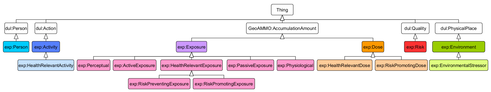
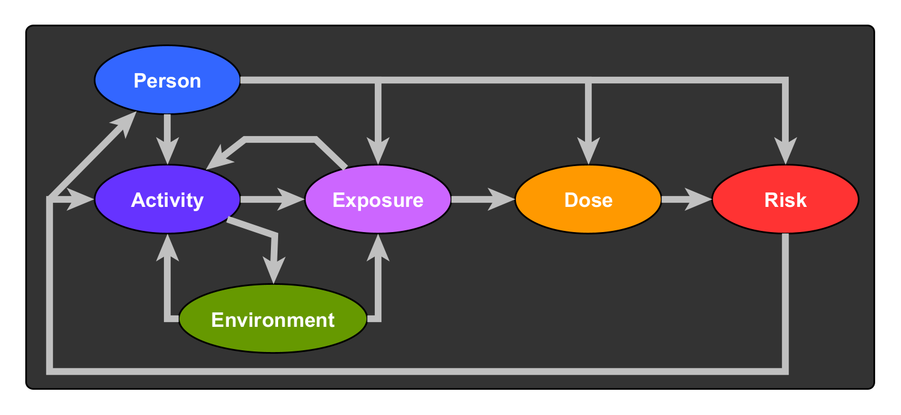

# exposureStudy
 
This folder contains the data sources and script used in the article "Ontology of active and passive environmental exposure". The script is used to load ontology based RDF descriptions of exposure related articles and to run inferences and queries over these descriptions in order to distinguish approaches
towards exposure measurement in the article.

## Data sources
1. *Ontology of active and passive exposure* (OWL 2) : [ExposureBasis.ttl](exposureStudy/ExposureBasis.ttl)
2. *Article descriptions in RDF* : [Helbich_2016.ttl](Helbich_2016.ttl),[Lipsett_2011.ttl](exposureStudy/Lipsett_2011.ttl),[Vermeulen_2019.ttl](exposureStudy/Vermeulen_2019.ttl),[Rongen_2020.ttl](exposureStudy/Rongen_2020.ttl),[Grinshteyn_2018.ttl](exposureStudy/Grinshteyn_2018.ttl),[Hillsdon_2006.ttl](exposureStudy/Hillsdon_2006.ttl)
3. *Python Script to run inferences and queries over article descriptions* : [main.py](exposureStudy/main.py)  
4. *Result tables* : [table2.tex](exposureStudy/table2.tex), [table3.tex](exposureStudy/table3.tex) 

## ExposureBasis
This is an overview of the classes specified in this ontology ([ExposureBasis](http://geographicknowledge.de/vocab/ExposureBasis)):

Classes are defined using possible causal exposure relations between the following base classes:

 
For details, see the article.

## 
